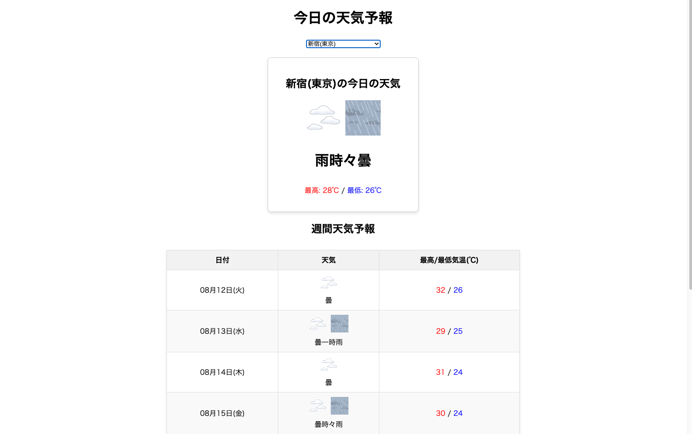

# Python/Flask Webスクレイピング 天気予報サイト



## 概要 (Overview)

このプロジェクトは、PythonとFlaskフレームワークを使用し、天気予報サイトから情報をスクレイピングして表示するWebアプリケーションです。
Pythonの基礎学習のアウトプットとして、Webスクレイピング、バックエンドAPIの構築、非同期処理(Ajax)、キャッシュの実装といった、実践的なWeb開発技術を盛り込んでいます。

## 主な機能 (Features)

-   **Webスクレイピング:**
    -   `requests` と `Beautiful Soup` を使用し、指定した地域の天気情報（天気、最高・最低気温、週間予報）をリアルタイムに取得します。
-   **インタラクティブなUI:**
    -   プルダウンで地域を選択すると、ページをリロードすることなく、JavaScript (fetch API) を使って非同期で天気情報が更新されます。
-   **パフォーマンス最適化:**
    -   `Flask-Caching` ライブラリを導入し、一度取得した天気情報をサーバーサイドでキャッシュします。これにより、APIの応答速度を向上させ、スクレイピング先のサイトへの負荷を軽減しています。
-   **エラーハンドリング:**
    -   スクレイピング先のサイトがダウンしている場合や、HTML構造が変更された場合にも、ユーザーに分かりやすいエラーメッセージを表示します。

## 技術スタック (Tech Stack)

-   **言語:** Python 3
-   **フレームワーク:** Flask
-   **ライブラリ:**
    -   `requests` (HTTPリクエスト)
    -   `Beautiful Soup 4` (HTML解析)
    -   `Flask-Caching` (サーバーサイドキャッシュ)
    -   `gunicorn` (本番用WSGIサーバー)
-   **フロントエンド:** HTML, CSS, JavaScript (Fetch API)
-   **データベース:** SQLite (初期学習時)
-   **バージョン管理:** Git / GitHub

## 環境構築・起動方法 (Setup)

1.  リポジトリをクローンします。
    ```bash
    git clone https://github.com/rrencanno/tenki_scraper
    ```

2.  プロジェクトディレクトリに移動し、Pythonの仮想環境を作成・アクティベートします。
    ```bash
    cd tenki_scraper
    python3 -m venv venv
    source venv/bin/activate
    ```

3.  必要なライブラリをインストールします。
    ```bash
    pip install -r requirements.txt
    ```

4.  Flask開発サーバーを起動します。
    ```bash
    flask run
    ```

5.  ブラウザで [http://127.0.0.1:5000](http://127.0.0.1:5000) を開きます。

## 注意事項

このアプリケーションは、外部のウェブサイト (tenki.jp) から情報をスクレイピングしています。
そのため、スクレイピング先のサイトの利用規約を遵守する必要があり、また、サイトのHTML構造が変更された場合、スクレイピングが機能しなくなる可能性があります。